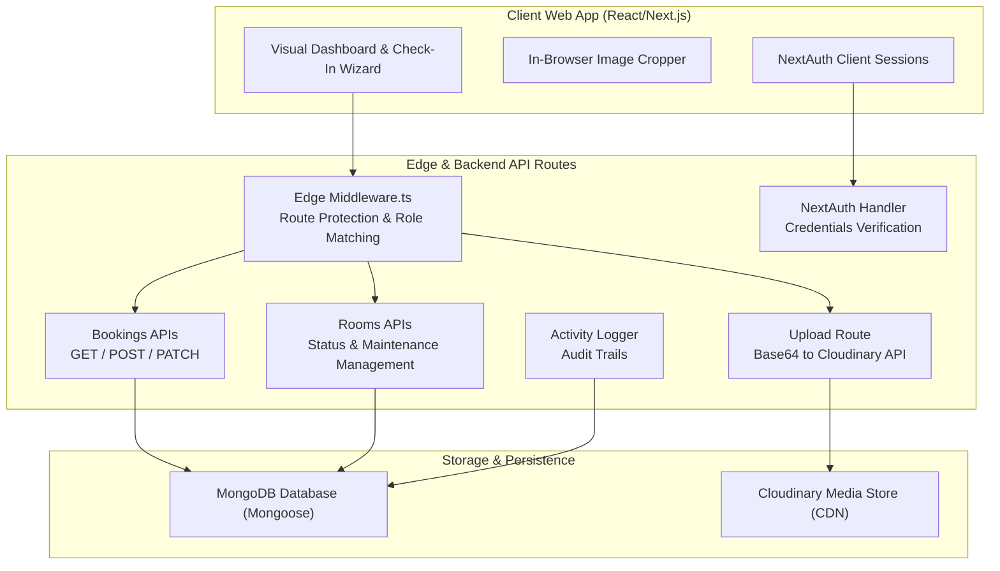
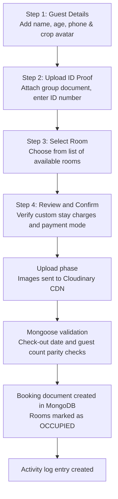

<p align="center">
  
</p>
<h1 align="center">SyncZen Cloud</h1>
<p align="center">
  <strong>Modern Cloud Hotel Check-In and Management System</strong><br/>
  <em>Process guest check-ins, manage rooms, track staff, and organize bookings in a glassmorphic dashboard</em>
</p>

<p align="center">
  
  
  
  
  
  
  
</p>

---

## Table of Contents

- [Overview](#overview)
- [Why SyncZen Cloud](#why-synczen-cloud)
- [Features](#features)
- [Architecture](#architecture)
- [Pipeline Flow and How It Works](#pipeline-flow-and-how-it-works)
- [Visual UI Guides](#visual-ui-guides)
- [Command Executor and Room Resolution](#command-executor-and-room-resolution)
- [Quick Start](#quick-start)
- [Project Structure and Key Components](#project-structure-and-key-components)
- [Dependencies](#dependencies)
- [Troubleshooting](#troubleshooting)
- [Author](#author)

---

## Overview

**SyncZen Cloud** (previously SyncStay Web) is a modern, cloud-based hotel check-in and property management platform. It acts as the web-based command center to manage hotel properties, coordinate rooms, track staff levels, and record guest bookings. With a custom-built 4-step wizard, users can check in guests, crop and upload guest photos, capture multi-document ID proofs, and dynamically calculate stays.

All uploads are routed securely to Cloudinary, ensuring instant CDN availability for guest records and ID documents.

---

## Why SyncZen Cloud

> **Traditional Property Management Systems (PMS) are clunky and localized. SyncZen Cloud brings responsive design, serverless scalability, and instant guest photo cropping to the browser.**

| Feature | Traditional PMS | SyncZen Cloud |
|---|---|---|
| **Check-in Workflow** | Complex form fields and manual steps | 4-step wizard (Guests → ID Proof → Room → Confirm) |
| **ID & Guest Photos** | Kept in local folders or physical files | Cropped in-browser and hosted on Cloudinary CDN |
| **Aesthetics** | Outdated, rigid desktop interface | Premium glassmorphic light/dark UI theme |
| **Roles & Permissions** | Static permissions | Weighted RBAC hierarchy (Super Admin, Owner, Manager, Staff) |
| **Billing & Adjustments** | Hardcoded room rates | Flexible overrides with custom stay charges |
| **Audit Logs** | Missing or hard to access | Dynamic, system-wide employee activity logging |

---

## Features

### 🎙️ Interactive Check-In Wizard
* **Step-by-Step Flow:** Clean linear wizard preventing out-of-order data submission.
* **Smart Calendar Picker:** Automatic popup date picker on desktop and mobile platforms via native `showPicker()` integration.
* **In-Browser Image Cropping:** Integrates `react-image-crop` to let staff crop guest avatars directly before uploading.
* **Dynamic Nights Calculator:** Live calculations of stay durations based on checkout date selection.
* **Guest Breakdown:** Enforces strict validation that male, female, and child guest counts match the total guest field.

### 🖼️ Cloudinary CDN Integration
* **Optimized Image Storage:** All guest avatars and group ID documents upload directly to Cloudinary.
* **Scoped Uploads:** Files are organized automatically under folder paths matching the hotel ID to facilitate audits.
* **Auto-format & Quality:** Auto-compression speeds up page rendering on staff dashboards.

### 🛡️ Weighted Role-Based Access Control
* **Super Admin:** Configured via environment variables; oversees all hotels and system-wide operations.
* **Hotel Owner:** Complete control over their registered hotel, invite keys, employees, and settings.
* **Manager:** Can add/edit rooms, adjust service/maintenance status, and manage staff members.
* **Staff:** Scoped to processing check-ins, executing checkouts, and viewing active bookings.

### 🏠 Operations Dashboard
* **Real-time Status Cards:** Quick summaries of total rooms, available slots, occupied rooms, and active bookings.
* **Live Occupancy Gauge:** Visual percentage meter highlighting current hotel capacity.
* **Recent Activity Feed:** Transparent audit logs recording all checked-in guests, room status updates, and checked-out bookings.

---

## Architecture



<details>
<summary>ASCII fallback (click to expand)</summary>

```
┌────────────────────────────────────────────────────────┐
│               SyncZen Cloud Web Application            │
│                                                        │
│  ┌────────────────────────┐    ┌────────────────────┐  │
│  │   Client UI (Next.js)  │───►│ Edge Middleware    │  │
│  │   Check-In Wizard      │    │ Route Protection   │  │
│  │   Image Cropper        │    │ Role Weights       │  │
│  └───────────┬────────────┘    └─────────┬──────────┘  │
│              │                           │             │
│              ▼                           ▼             │
│  ┌────────────────────────┐    ┌────────────────────┐  │
│  │  NextAuth Sessions     │◄──►│ NextAuth Backend   │  │
│  │  Client JWT            │    │ Credentials Auth   │  │
│  └────────────────────────┘    └────────────────────┘  │
│                                                        │
│  ┌────────────────────────┐    ┌────────────────────┐  │
│  │  MongoDB Database      │◄──►│ API Routing Layer  │  │
│  │  Mongoose Models       │    │ Bookings / Rooms   │  │
│  │  History & Logs        │    │ Upload / Seed APIs │  │
│  └────────────────────────┘    └─────────┬──────────┘  │
│                                          │             │
│  ┌────────────────────────┐              │             │
│  │  Cloudinary CDN        │◄─────────────┘             │
│  │  Avatars & ID Proofs   │                            │
│  └────────────────────────┘                            │
└────────────────────────────────────────────────────────┘
```

</details>

---

## Pipeline Flow and How It Works

### Check-In Workflow



<details>
<summary>ASCII fallback (click to expand)</summary>

```
Step 1: Guest Details (Add name, age, crop avatar, select check-out date)
     │
     ▼
Step 2: Upload ID Proof (Attach group documents, specify ID number)
     │
     ▼
Step 3: Select Room (Select one or multiple rooms in available state)
     │
     ▼
Step 4: Confirm Details (Verify custom nightly rates, specify payment mode)
     │
     ▼
Submit → Base64 uploads dispatched to Cloudinary CDN (File IDs & CDN URLs returned)
     │
     ▼
MongoDB validation (Ensures guest count breakdown matches total guest count)
     │
     ▼
Mongoose Transaction (Creates Booking, marks Room status as occupied)
     │
     ▼
Log Activity (Saves log entry for room allocations)
```

</details>

---

## Visual UI Guides

The system features visual components styled using a customized glassmorphic design system:

### Visual Panels

| Panel | Description | Controls |
|---|---|---|
| **Check-in Wizard** | 4-step wizard showing clear progress highlights. | Next, Back, Add Guest, Remove Guest, Complete Check-In |
| **Room Grid** | Adaptive grid showing available room tiles. | Click to select, hover for room numbers and rates |
| **Recent Bookings Table** | Interactive listing of the hotel's latest check-ins. | Click row to open booking detail page |
| **Status Cards** | Glassmorphic dials showing metrics. | Real-time counts of rooms, check-ins, and occupied spaces |
| **Sidebar Menu** | Glassmorphic navigation panel lock on the left. | Links to Dashboard, Rooms, Bookings, Employees, Settings |

---

## Command Executor and Room Resolution

When a guest check-in is submitted, rooms are processed via the reservation engine:

```
1. Room Identification (Resolves MongoDB ObjectID targets)
      │
      ▼
2. Availability Check (Ensures target room state is currently 'available')
      │
      ▼
3. Custom Charge Evaluation (Applies custom night charge, fallback to room base rate)
      │
      ▼
4. State Transformation (Mongoose updates room state to 'occupied')
```

### Safety and Validation Failsafes
* **Parity Constraint:** The application blocks booking submissions if the sum of male, female, and child guest counts does not equal the total guest count.
* **Stay Limit:** Stays must be for a minimum of 1 night.
* **Double Check-In Protection:** Checks room state inside an active database session to prevent double-booking identical rooms.
* **Maintenance Block:** Rooms marked "Under Maintenance" cannot be selected for new check-ins.

---

## Quick Start

### Prerequisites
* **Node.js:** v18.0 or higher
* **npm / yarn / pnpm**
* **MongoDB:** An active connection string (Atlas or Local)
* **Cloudinary:** A free-tier account for image hosting

### Run from Source

```bash
# 1. Clone the repository
git clone https://github.com/Felix-au/SyncZen-Cloud.git
cd Sync-Zen-Cloud

# 2. Install dependencies
npm install

# 3. Setup environment variables
cp .env.example .env.local
# Fill in your MONGODB_URI, NEXTAUTH_SECRET, and CLOUDINARY credentials

# 4. Seed the default Super Admin account
# Set SUPER_ADMIN_EMAIL and SUPER_ADMIN_PASSWORD in .env.local, then bootstrap:
curl -X POST http://localhost:3000/api/seed

# 5. Launch the development server
npm run dev
```

Open [http://localhost:3000](http://localhost:3000) to access the application.

---

## Project Structure and Key Components

```
Hotel Sync Cloud/
├── app/                         # App Router Pages
│   ├── (hotel)/                 # Sidebar Pages (Dashboard, checkin, rooms, bookings, employees, settings)
│   ├── api/                     # REST Backend endpoints (seed, bookings, rooms, employees, upload)
│   ├── login/                   # Login Page
│   ├── register/                # Staff Registration Page
│   ├── join/                    # Join Hotel Page (using Invite Keys)
│   ├── globals.css              # Glassmorphic Design System Stylesheet
│   ├── layout.tsx               # Main HTML wrap & Providers
│   └── page.tsx                 # Client Redirect Root
│
├── components/                  # Shared UI components
│   ├── StepWizard.tsx           # Check-in Progress Bar
│   ├── PhotoUpload.tsx          # Upload Trigger component
│   ├── ImageCropper.tsx         # react-image-crop popup overlay
│   └── Sidebar.tsx              # Left navigation panel
│
├── lib/                         # Business Logic & DB Connectivity
│   ├── models/                  # Mongoose Schemas (User, Hotel, Room, Booking)
│   ├── auth.ts                  # NextAuth Configuration (Credentials + Database)
│   ├── auth-edge.ts             # Edge-compatible NextAuth verification for Middleware
│   ├── cloudinary.ts            # Cloudinary Upload/Delete Client
│   ├── mongodb.ts               # Database Connection Handler
│   └── roles.ts                 # Role weights and permission gates
│
├── __tests__/                   # Jest Unit Test suites
├── package.json                 # Node package configuration
└── middleware.ts                # Route protection middleware (Edge Runtime)
```

---

## Dependencies

| Package | Purpose |
|---|---|
| `next` | Next.js 15 App Router React Framework |
| `mongoose` | MongoDB ODM mapping and Schema validation |
| `next-auth` | Authentication framework (v5 App Router support) |
| `cloudinary` | Cloudinary Node.js SDK for media uploads |
| `react-image-crop` | Native canvas crop utility for guest avatars |
| `bcryptjs` | Password hashing for secure user registration |
| `jest` | Unit testing framework |

---

## Troubleshooting

### Calendar does not open on clicking the date field
* The input field uses modern browser APIs (`showPicker`). Ensure your desktop browser (Chrome, Edge, Firefox) is updated. 

### Uploads fail during check-in
* Ensure that `CLOUDINARY_CLOUD_NAME`, `CLOUDINARY_API_KEY`, and `CLOUDINARY_API_SECRET` are correctly populated in `.env.local` and match your Cloudinary dashboard credentials.

### Mismatch Guest Count Error
* Ensure the male, female, and child numbers sum exactly to the "Total Guests" input field in Step 1.

---

## Author

**Felix-au** (Harshit Soni)

* 🔗 GitHub: [github.com/Felix-au](https://github.com/Felix-au)
* 📧 Email: [harshit.soni.23cse@bmu.edu.in](mailto:harshit.soni.23cse@bmu.edu.in)

---

<p align="center">
  <sub>Built for hoteliers who value visual aesthetics and operational speed.</sub>
</p>
